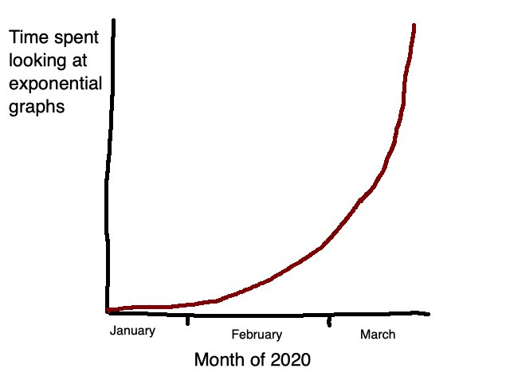

# COVID-19 statistics, data, analyses, etc.

 [source](https://twitter.com/woke8yearold/status/1243547718439575552/photo/1)

## stories about data
* https://www.wired.com/story/the-mathematics-of-predicting-the-course-of-the-coronavirus/
* https://www.themarshallproject.org/2020/03/27/as-coronavirus-surges-crime-declines-in-some-cities

## projections:
* https://covid19.healthdata.org/projections
* https://projects.propublica.org/graphics/covid-hospitals?geo=Pittsburgh,%20PA
* https://covidactnow.org/us/pa

## maps:
* https://alcogis.maps.arcgis.com/apps/MapSeries/index.html?appid=abaca148492b47a7ad0d5a71f5d2c5e8

## data viz:
* https://public.flourish.studio/visualisation/1741938/
* https://twitter.com/dergigi/status/1243315176000180224/photo/1

## A little reassurance:
https://twitter.com/SuperASASSN/status/1244039816804806659?s=20