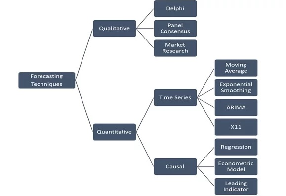

# Week 1

## Agenda
1. [Let's introduce ourselves](#introductions)
2. [We have a syllabus; it will change](#syllabus)
3. [So, what are our plans this semester?](#plans)
4. [Forecasting](#forecasting)

## 1. Let's introduce ourselves

You've all taken DAT-201, but you didn't all take it at the same time.

## 2. We have a syllabus; it will change.

[Here it is](../DAT-202_Course_Outline_2020_Spring.docx?raw=true).

We're going to mess with this schedule a lot over the course of the semester, though. Let's start now:
1. Do you want to do points-based grading or self-assigned grades? I'm open to either.
2. Let's talk a bit about our topics and our planned approach to covering them (see below, "3. So, what are we up to this semester?")
3. Can you live with GitHub, or shall I open our Blackboard shell?

## 3. So, what are we up to this semester?

(You don't have to read all of this. I'm going to say it all in class, too.)

Here are our assigned learning outcomes for the semester:
1. Differentiate the data needs for the different forecasting techniques.
2. Use appropriate database for specific forecast.
3. Implement data analytics forecasting.
4. Collaborate on using data for forecasting.
5. Use data visualization to illustrate forecasts.

Additionally, our course description talks about "the different types of forecasting techniques such as sales, risk, retention, and attrition as applied to a variety of industries."

I want us to do some regression analysis and maybe some simple machine learning in Python. But I think we should start with more basic tools like spreadsheets and moving averages (both because not everyone will have taken Python 2, yet, _and_ because there are professional data analysts whose whole jobs revolve around Excel&mdash;it's an important and powerful tool that I would be remiss to skip over entirely).

Speaking of being remiss, maybe, we kind of let the last couple of sections of 201 slide on the whole "collaboration" front, despite what the master syllabus for the course might have required. (I probably shouldn't put that in writing, but here we are.) I'd like us to work together as a class to figure out how we're going to build that in, this semester. The two ideas I'm bringing to the table:
1) Peer teaching (maybe in lieu of a mid-semester project?)
2) Working as groups for a final project

But I'm open to any other ideas you all might have!

The other thing the Data Analytics faculty have really wanted to do for you&mdash;this is relevant to point 2 above&mdash;but we haven't figured out exactly what it looks like, is to do "group projects," in a sense, but to really break out the steps of a data analytics workflow ([e.g.](https://www.researchgate.net/figure/Workflow-for-Big-Data-Analytics_fig1_303821919)) and have one person do each step, then hand it off to another person, and so on. Because sometimes you'll be just one point in the pipeline: maybe someone else cleaned the data, and it's your job to make visualizations. Or you're cleaning the data so someone else can combine it with something else to make a set of predictions. Or you're given a model or set of predictions and asked to perform validation on it/them. We want to give you this experience, but just haven't figured out quite how to put that together. So maybe let's talk about that?

## 4. So what even is forecasting?

 *image from [brillio.com](https://www.brillio.com/insights/choosing-the-right-forecasting-technique/)*

This course is mostly going to be about quantitative methods, and we will not limit ourselves to the ones in this chart. (Also, some of them have interesting subsets that I think we should talk about in some detail.)

But let's do a little qualitative forecasting tonight, just so that you have the experience, shall we?

### Qualitative methods

There are only six of us (five of you, if I cheat and count the items ahead of time), so we'll see whether we notice a difference in these two methods, I guess!

First, we're going to guess the number of items in a jar! As a group! This is referred to as "panel consensus." 

Then, we will go through the Delphi method to guess the number of _different_ items in a _different jar_. 

While "panel consensus" is mostly what it sounds like&mdash;talk it over as a group and see what kind of answer people seem to agree on&mdash;it might be helpful to have some background on the [Delphi method](https://en.wikipedia.org/wiki/Delphi_method). 

After doing these activities, let's **talk over the pros and cons of each and how accurate we think they might be**. 

The final qualitative method listed on the chart above is "market research." 