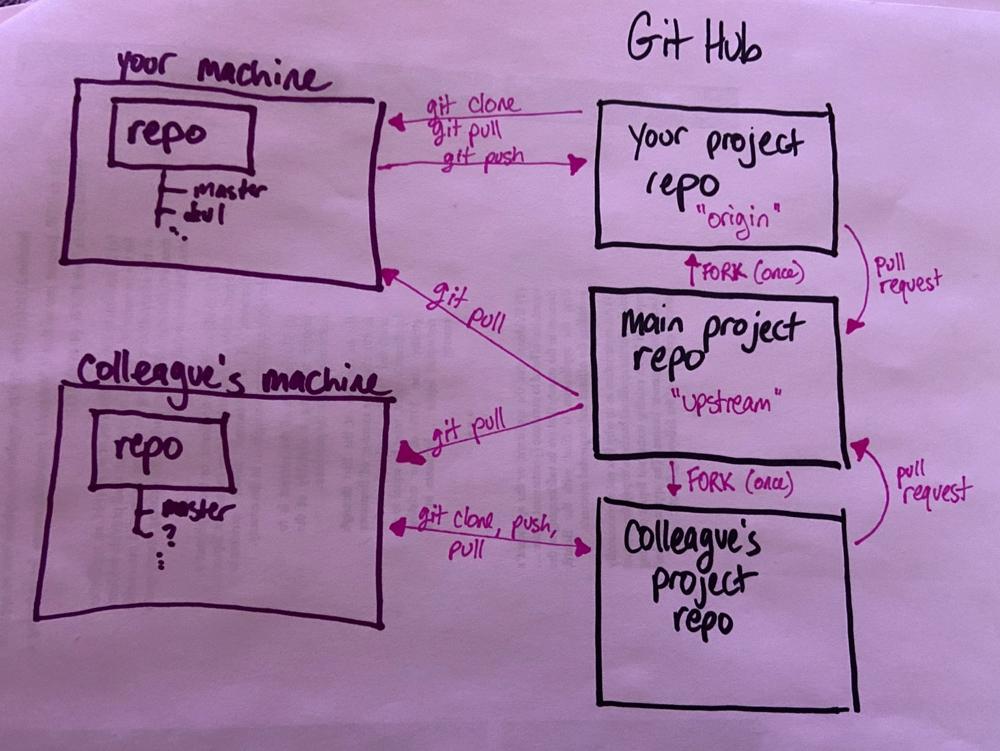

# How to GitHub

## Multiple repositories, multiple people

The model used in DAT-129, where you're added as a collaborator on someone else's repository, is good to use and to know about when the circumstances call for it. We are _not_ going to reproduce that model here, because there's another model you'll also need practice with: often, you will _not_ be added as a collaborator, with all of the rights that entails, but you nonetheless have helpful changes to make.

We're going to switch repositories now. 

And here's a sketch of our model, to try to help us keep straight what is happening:

1. `cd` into whatever you're using as a parent directory (my advice: /c/Users/your_username/Documents/) so that you aren't making a Git repo inside a Git repo (which is a surefire way to make yourself very unhappy). 
1. Take your browser to [our datasets repository](https://github.com/ccac-data-analytics/datasets) and **do not clone it.**
1. You're going to fork it to your own account. There's a button for that at the top right (way higher than the clone button).
1. Now you're going to clone **your copy of the repository.** 
1. After you've cloned your copy of the repository onto your own machine, navigate into the directory it just created. Let's see what remotes we have.
	* `git remote -v`
1. OK, nothing new so far, right? We have one remote, called "origin," which sits on our own GitHub account. Great!
1. Now we're going to add another remote, so that we're able to pull down changes when they happen on the repository we forked from. We're going to name it `upstream` (this is convention, not a hard and fast rule).
	* 'git remote add upstream https://github.com/ccac-data-analytics/datasets.git'
1. If we do `git remote -v` again, we can see we have two remotes, now: origin and upstream.
1. Now, I'm going to make a change to our upstream repo, so you can all pull them down and push them to your own repos. (**Don't type the next few things you see me typing**, OK?)
1. I made changes on the ccac-data-analytics copy of the repository (on the master branch). To pull them down to your **local** repository, you'll type this:
	* `git pull upstream master`
1. To push them to **your own remote repository** you'll type this:
	* `git push origin master`
1. OK, now you know how to keep your local repository up to date with someone else's repo that you have no control over. That's powerful! There's a lot you can do with just that&mdash;maybe you have your own fork of an open source project, but you want to keep it up to date with what the community is doing. Valid! Useful! 

But now, let's say you make a change that you want reflected in the main repository. You've got a really good bugfix or cool new feature or something, right? Great!

You need to make the changes on your local repo, push it to your own remote repo, and then issue a pull request from your remote to the main repository, since you don't have the rights to push to it directly. 

(We're over-simplifying a little bit, doing all of this in the master branch. If we're feeling very powerful when we're through this, we'll add other branches to the mix, to make it more like what happens in a big open source project. But this is a whole lot of GitHub at once, so I'm going to call us successful even if we never combine multiple branches _and_ multiple remotes into the same command.) 

One by one, we are going to go through this. I'll walk you each through it if you want. But you need to wait your turn&mdash;**don't do this next bit until I tell you, individually, to do so.**
1. First, you need to pull down any changes from upstream. 
1. Now, navigate into the practice directory, and make a change (add a file, let's say) on your local machine.
1. Push it to **your** remote. (Remember to navigate back up a directory before adding and committing)
1. Go to [the upstream repo on GitHub](https://github.com/ccac-data-analytics/datasets), and create a pull request.
1. I'll accept it. We'll move on to the next person. 

TODO: the git rm command

## About .gitignore

Ever used a Mac or looked at the repo of [someone who used a Mac](https://github.com/csheldonhess/citizen-weed-warriors) and seen that annoying .DS_Store file show up?

More importantly: have you ever had a private API key that you probably clicked something and agreed you wouldn't share with the world? (Let's make a pretend one, shall we?) Go ahead and type the following: 
	* `touch api-key.txt`

Situations like the ones above are why we have .gitignore.

First, you have to create it (make sure you're in the top directory of your github_practice repo):
	* `touch .gitignore`

Then you want to put in whatever files you want it to ignore. Since a file that starts with a period is hidden from Windows and MacOS by default, the easiest thing for us to do is edit it in the CLI:
	* `nano .gitignore`

And then literally just type "api-key.txt" (without the quotation marks) and hit ctrl-x and enter to save. 

Let's test it:
* `git add *`
* `git commit -m "added gitignore"`
* `git push origin master`

And let's go see what shows up on the public repo!

## A couple more notes; one might call this section "miscellaneous"

* If you really get into a bind, with merge conflicts in binary files or Git just acting super weird, and there's nothing vital on your local repository, you can remove it (**just the local copy!**) and re-clone. For that matter, if there *is* something vital, and you know what it is, you can move it to another directory and then delete the local repository/directory. I've done that more often than someone teaching you Git should probably admit to, but there we are.